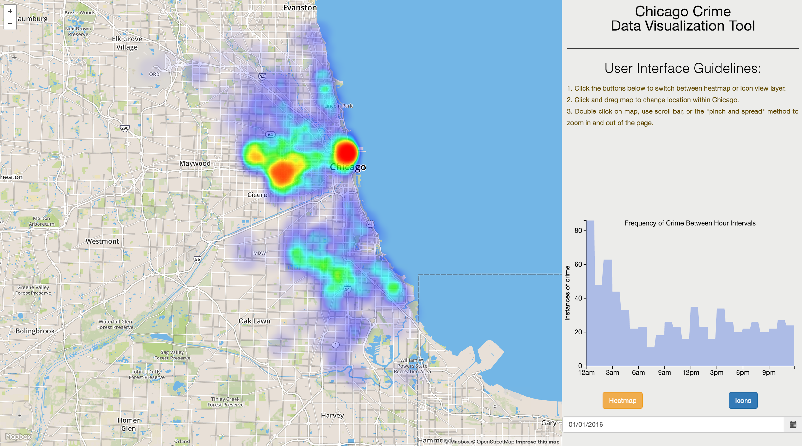
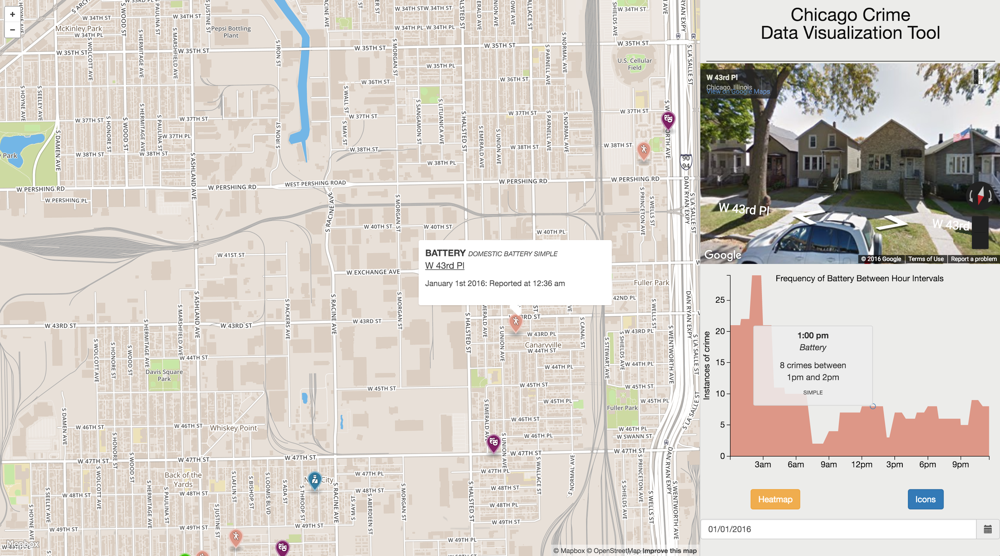

# Chicago Crime Data Visualization Tool 

## Team: Corey Ching & Andrew Kwon

[https://data.cityofchicago.org/Public-Safety/Crimes-2001-to-present/ijzp-q8t2](https://data.cityofchicago.org/Public-Safety/Crimes-2001-to-present/ijzp-q8t2)

[https://data.cityofchicago.org/Public-Safety/Chicago-Police-Department-Illinois-Uniform-Crime-R/c7ck-438e](https://data.cityofchicago.org/Public-Safety/Chicago-Police-Department-Illinois-Uniform-Crime-R/c7ck-438e)

**_The Data_**

Welcome to the Chicago Crime Data Visualization Tool! Since the early 20th Century, the city’s overall crime rate, especially the violent crime rate, has been substantially higher than the United States average. With the generous data provided by by the Chicago Police Department’s Bureau of Records, we decided that the detailed dataset would allow for a fascinating exploration of the city, the discovery of various types of crime in respect to time, and the locations in which crimes are most concentrated in the city.

The purpose of this application is be to visually explore the city of Chicago and provide the user with an interface to discover where crime-ridden areas are located and which specific types of crime are most prevalent in which concentrated areas in the city. Consequently, another purpose of the app will be perhaps to suggest that there be increase of security in certain areas and further exploration of why certains crimes are specifically concentration in different areas. From the start, our approach to this data visualization application was to provide the user with enough freedom to explore and discover crimes around the actual city of Chicago to parallel reality as closely as possible.

**_The Initial Proposal_**

Initially, we decided to pursue a web application tool using Angular 2, D3, and Threejs. We determined that the application would have many different types of views, and considered the implementation of an interactive navigation bar or sidebar that modifies, filters, or updates the data visualization shown. Another idea was to have multiple data visualization panels detailing the data set in disparate ways, showing the various dimensions of data through different visualizations.

Most importantly, we decided that the primary visualization will be a map of the city that would provide the interface of showing the location of various types of crime. Secondary visualizations that we considered included overview geographic heat maps, linked layout graphs, and various other graphs and charts to provide support or other means in interacting with the primary map.	

For the heat maps, the color can be interpolated to be able to represent the severity of crime in a general area, and the size can represent the boundaries in which the crime is concentrated.

We hope to be able to implement the application so that the user has control over most aspects of the data. Specifically, we decided to focus mostly on freedom of choosing the location of one or many crimes in various different views. For instance, the user may be able to pan and zoom over different regions of the city and explore crimes in those areas. 

**_How the visualization changed throughout the design / implementation process:_** 

We created a side view that acts as both a menu and a presentation area for two sub views that present more detailed information for a selected crime. This installation has two design decisions that differed from the proposal. First, we came up with the side view to put UI elements in the view without visually conflicting with the map. Secondly, our two sub visualizations were new ideas that came up in the implementation process. The first, is a Google Maps Street View that allows the user to see the exact location of the reported crime. Next, we present an area graph that shows aggregate frequency of all types on the selected day, or the frequency of a specific type of crime when you select a crime on the map. Lastly, we initially wanted to use a slider to change the time, but, we changed to a calendar picker because it gives a better presentation to the user on which day you can select. 

Moreover, we noticed a single day has a high number of crimes, which fills our map up with many icons. We initially planned on allowing the user to select a range of days to visualize, however, we decided to limit them to a single day because the map would become cluttered. 

Lastly, we decided to forgo the "colored network map" because through the heat map view and icon view layer, we felt the user could see general locations of particular types of crimes already. Instead, we chose to use the real estate space on our UI for graphs that presented different type of information. Thus, we made the choice to include the Google Street Maps View (allows the user to have real world context of an address). As well, the user can explore the surrounding area in the street view, or easily click the link to Google where they can explore further. Secondly, we made the choice to add the area graph because it presents a given crime in context with the time of day. As well, we present aggregate information (the frequency of all crime types in a given day) in contrast to seeing isolated instances in our other views.

**_Things That Worked and Things That Didn't:_**

Utilizing mapbox.js, creating a heat map, building an icon marker view, utilizing d3.js to build an area graph, implementing google maps javascript sdk for the street view all worked. Also, we are pleased aesthetically with the decision to create a side menu. 

	There are some responsive design issues that have room for improvement. The caret on the tooltip when selecting an icon is distorted. This was a minor detail we were not sure why it was rendering incorrectly. 

**_What We Learned From This project_**

We have learned that it is of utmost importance to consider the user in visualization applications and ensure that the application is simple enough to use. Especially with our application, as we have many various components, we realized that we should have made it more simple or given some more detailed guidelines in using our application. We could have also made our area chart more clear to the user of what it is representing. 

**_The Final Visualization_**

The final visualization fortunately resembles our initially projected view of the application. There were many features we could not implement in time and various aspects of the interface we had to change for the sake of either usability or incompatibility. However, we believe that we have achieved goals mentioned in our first project proposal. 

The visualization application first shows a map of Chicago with a heatmap overlay of crimes, showing the locations where crimes are most concentrated. The user can select the icon button to display all crimes for the currently selected day on the map in markers. The sidebar displays user interface guidelines as well as an overall area chart of the frequency of crimes between hour intervals for the first day of 2016. The sidebar also shows buttons where the user can click to toggle between a heatmap view or icon view of the crimes on the map. Lastly, a tab with a popup calendar provides the interface in which to choose a day. Once a user chooses the icon view and selects a marker on the map, an embedded window to the street view of that exact location will be shown in the sidebar. A tooltip will also appear above the marker displaying details of that specific crime such as location, time, and descriptions of the crime. The area chart will also update its values to show the instances of crime for that specific type of crime (e.g., battery, theft, kidnapping). Hovering the mouse over the area chart will bring up a tooltip displaying more details about the specific moused-over point in the chart.

For this project, we utilized a large variety of tools and frameworks to implement this application. For the map and icon view, we used the Mapbox platform with the Leaflet to overlay a heatmap visualization. We used the Google Street View Panorama API for the street view in the sidebar, D3 for the area chart, Bootstrap date-picker for the calendar interface, and Angular, underscore.js, and jQuery for our development tools and frameworks. 

**_How we split the project up_**

The Initial Set-Up:

Andrew extracted the crime data from the city of Chicago’s website and in node, converted our dataset into json, and processed the data to be sorted by day.

Corey set-up the app using the Angular framework by setting up the routes, constructing the views, and binding their respective controllers to them. Secondly, he integrated the mapbox api to load the initial view. 

Second phase:

After setting up the base project, we split the two main views up. Andrew implemented the icon view layer using mapbox, and Corey created the heatmap layer using mapbox and leaflet. 

Third phase:

The next stage was developing the side-bar menu. We split two UI controls, the calendar date picker and the toggle buttons up. Andrew integrated the calendar date range picker, and Corey integrated the buttons to toggle the map between the heatmap and icon view layer. 

Fourth phase:

Next we split the two sub-views up. Andrew build the d3 area graph and Corey integrated Google maps javascript SDK to display the street view. Corey integrated the day selection to update all the views with that given day’s data. 

Final phase: 

Andrew and Corey worked together to clean up the UI and polish the styling for the final presentation. 

	

